## Front matter
lang: ru-RU
title: Презентация по лабораторной работе №1
subtitle: Основы информационной безопасности
author:
  - Черная С.В.
institute:
  - Российский университет дружбы народов, Москва, Россия
date: 22 февраля 2025

## i18n babel
babel-lang: russian
babel-otherlangs: english

## Fonts
mainfont: PT Serif
romanfont: PT Serif
sansfont: PT Sans
monofont: PT Mono
mainfontoptions: Ligatures=TeX
romanfontoptions: Ligatures=TeX
sansfontoptions: Ligatures=TeX,Scale=MatchLowercase
monofontoptions: Scale=MatchLowercase,Scale=0.9

## Formatting pdf
toc: false
toc-title: Содержание
slide_level: 2
aspectratio: 169
section-titles: true
theme: metropolis
header-includes:
 - \metroset{progressbar=frametitle,sectionpage=progressbar,numbering=fraction}
 - '\makeatletter'
 - '\beamer@ignorenonframefalse'
 - '\makeatother'
---

# Информация

## Докладчик

:::::::::::::: {.columns align=center}
::: {.column width="70%"}

  * Черная София Витальевна
  * студентка группы НКАбд-01-23
  * Российский университет дружбы народов

:::
::: {.column width="30%"}

:::
::::::::::::::

## Цель

Целью данной работы является приобретение практических навыков
установки операционной системы на виртуальную машину, настройки ми-
нимально необходимых для дальнейшей работы сервисов.

## Задание

1. Установка и настройка операционной системы.
2. Найти следующую информацию:
	1. Версия ядра Linux (Linux version).
	2. Частота процессора (Detected Mhz processor).
	3. Модель процессора (CPU0).
	4. Объем доступной оперативной памяти (Memory available).
	5. Тип обнаруженного гипервизора (Hypervisor detected).
	6. Тип файловой системы корневого раздела.
	
	
## VitualBox

Захожу в VirtualBox(т.к. я выполняю лабораторную работу на домашнем компьютере) и нажимаею кнопку создать в верхней части экранаю

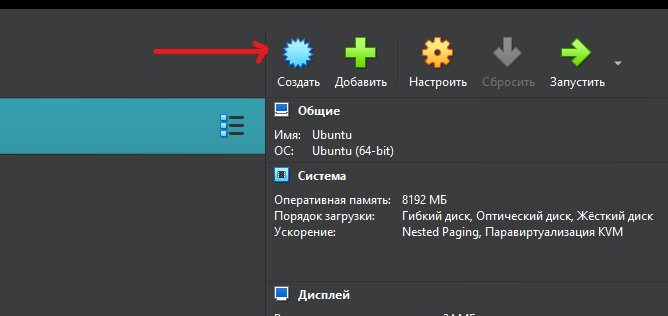{#fig:001 width=70%}

## Имя и тип OS

Выбираю имя. Папку оставляю без изменения, потому что этот путь меня устраивает. Так же выбираю образ ISO, скаченный с официального сайта Rocky. У меня файл dvd, так как Boot предназначен для восстановления системы.Minimal будет устанавливать очень простую рабочую систему с оболочком и некоторыми коммунальными установками. DVD имеет все программное обеспечение, включенное в ISO

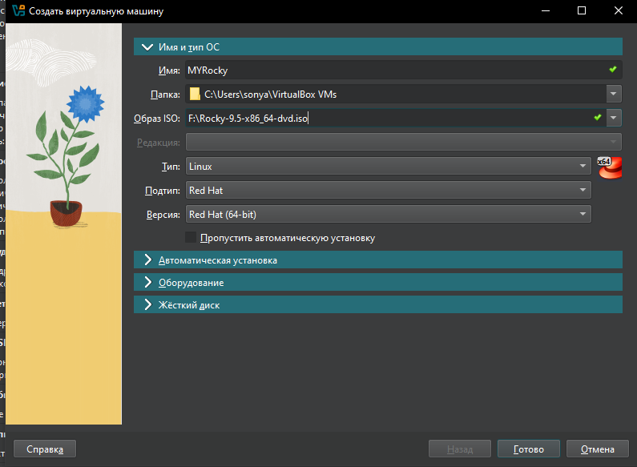{#fig:002 width=70%}

## Автоматическая установка

Автоматическую установку пропускаю

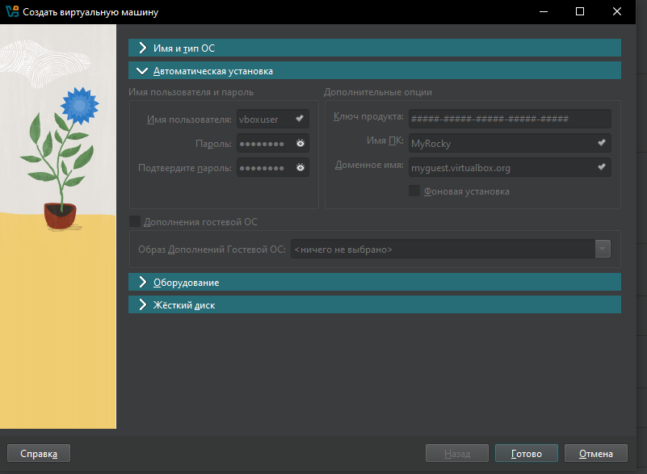{#fig:003 width=70%}

## Оборудование

В разделе оборудование для основной памяти я уделяю 4096 МБ, а процессора ставлю 2

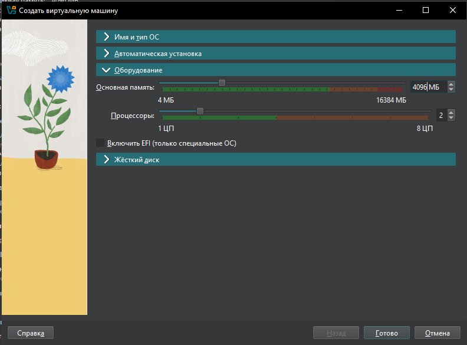{#fig:004 width=70%}

## Жёсткий диск

В разделе жесткий диск создаю новый виртуальный жесткий диск, уделяя ему размер в 50 ГБ. Тип и формат жесткого диска оставляю VDI

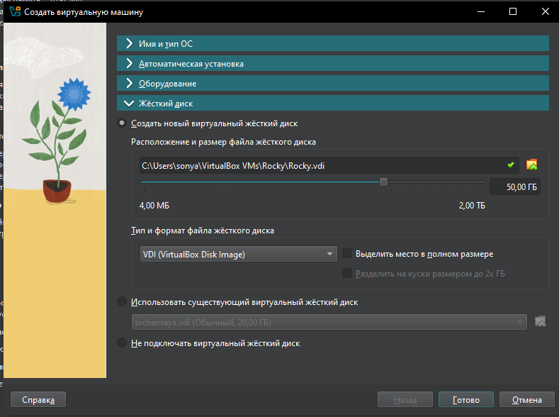{#fig:005 width=70%}

## Носители

В настройках виртуальной системы, в разделе носители проверяю наличие ISO файла

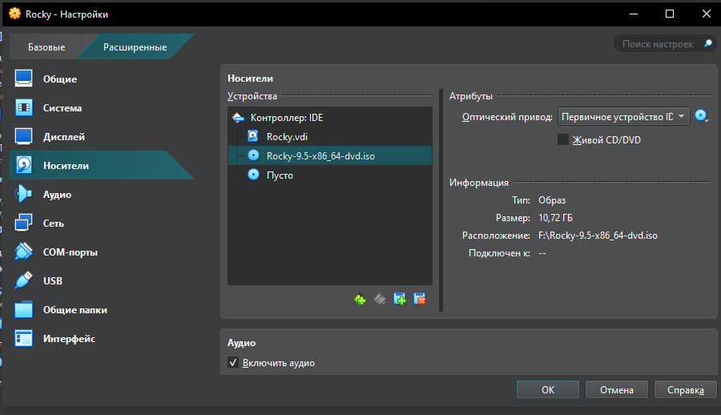{#fig:006 width=70%}

## Загрузка ОС

Запускаю виртуальную систему через install rocky linux 9.5

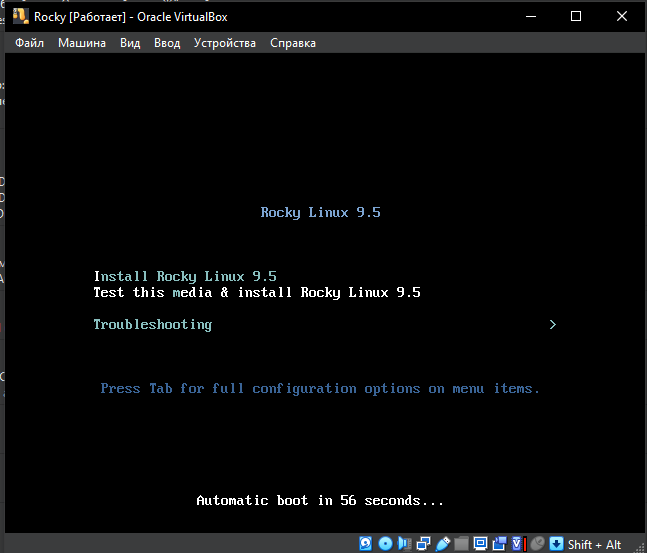{#fig:007 width=70%}

## Раскладка клавиатуры

Далее переходим в настройки виртуальной системы, в качестве раскладки клавиатуры выбираем Английскую и Русскую

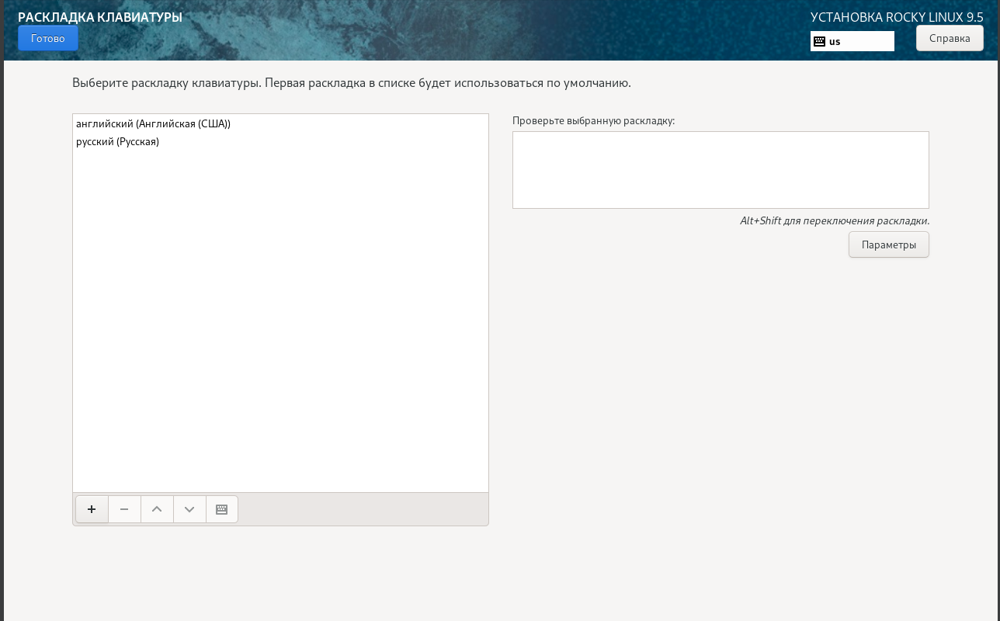{#fig:008 width=70%}

## Дата и время

В разделе дата и время оставляю московское

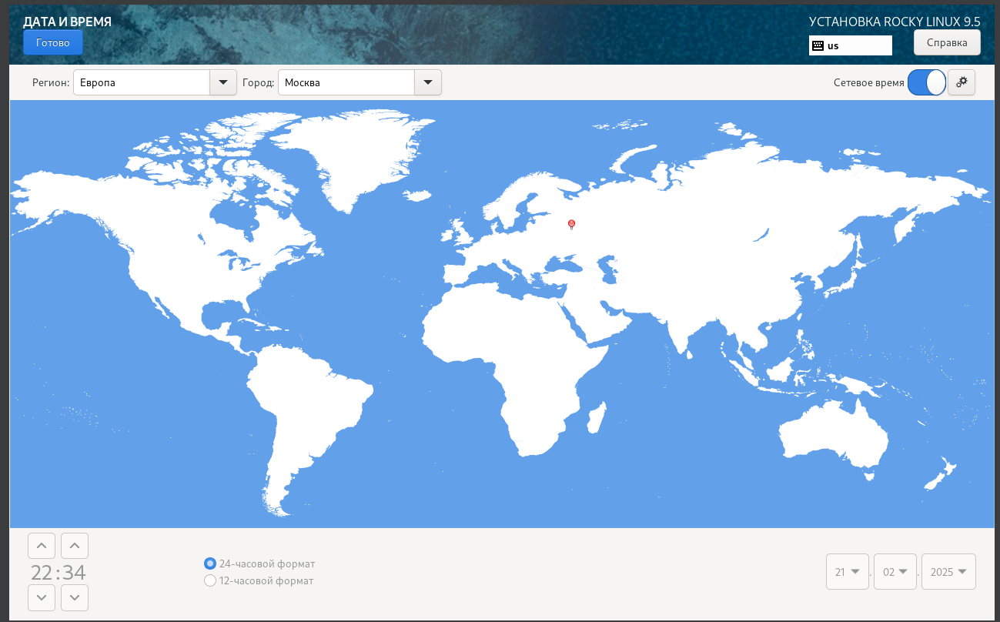{#fig:009 width=70%}

## Выбор программы

Далее в разделе выбор программы в качестве базового окружения устанавливаю сервер с GUI, а в выбранном ПО для выбранной среды устанавливаю стандартную среду разработку(средства разработки)

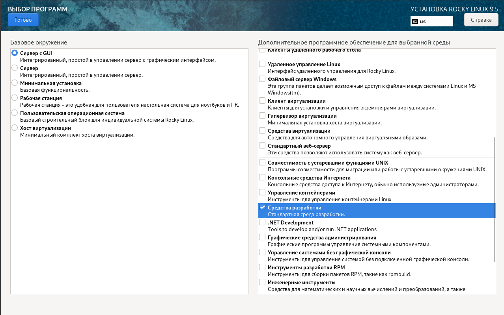{#fig:010 width=70%}

## Kdump

Выключаю Kdump

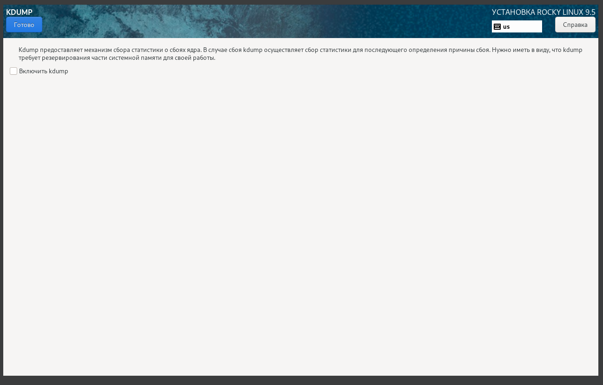{#fig:011 width=70%}

## Сеть

Подключаю инетрнет в разделе "Сеть и имя узла"

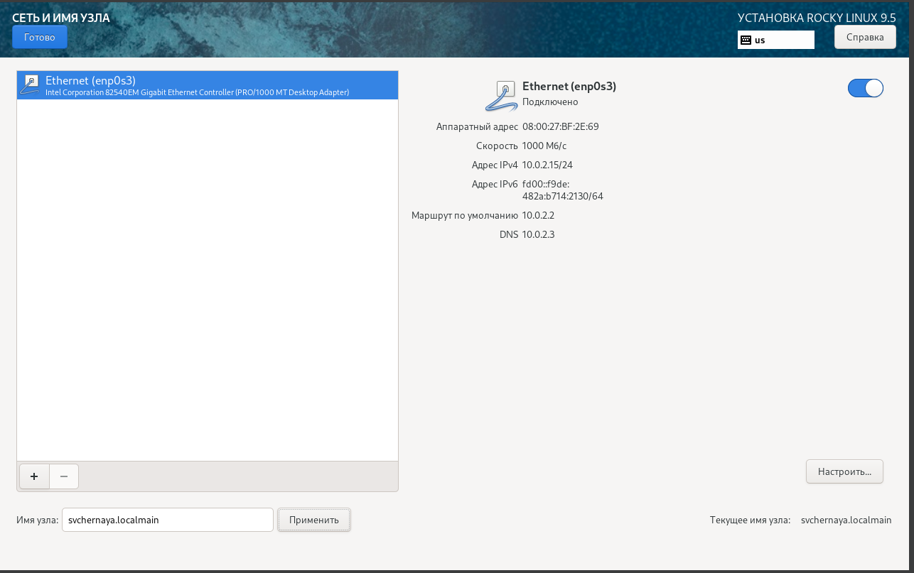{#fig:012 width=70%} 

## root

Устанавливаю пароль для root(администратора)

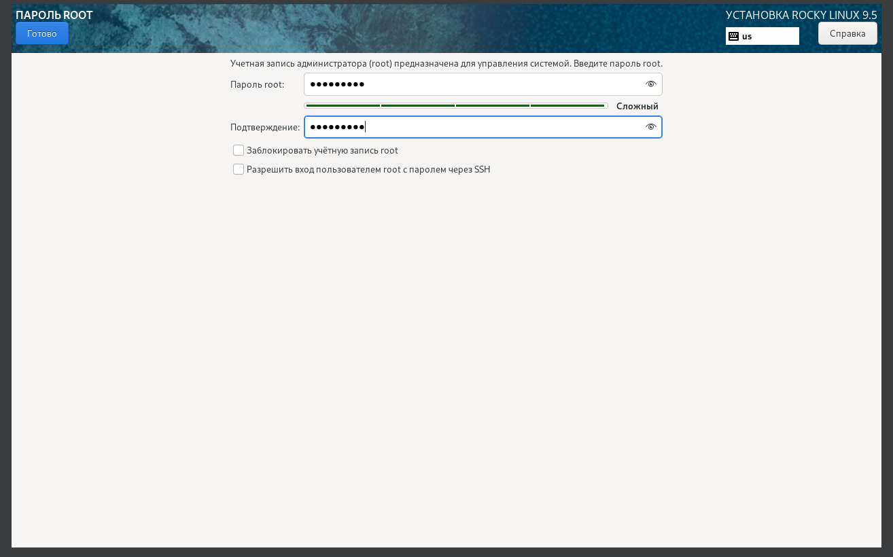{#fig:013 width=70%} 

## Пользователь

Создаю пользователя и пароль для него 

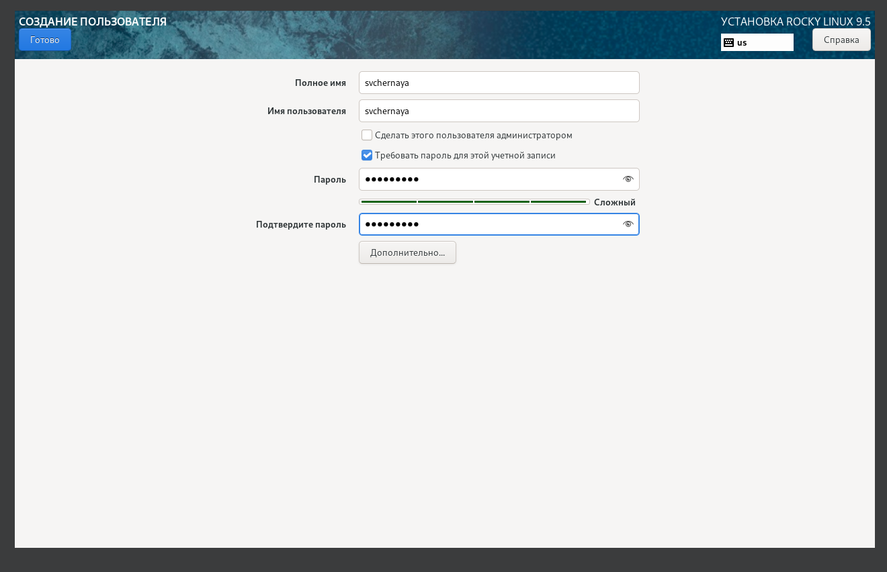{#fig:014 width=70%}

## Установка

Устанавливаю операционную систему Rocky и после загрузки корректно ее перезагружаю(кнопка перезагрузка системы)

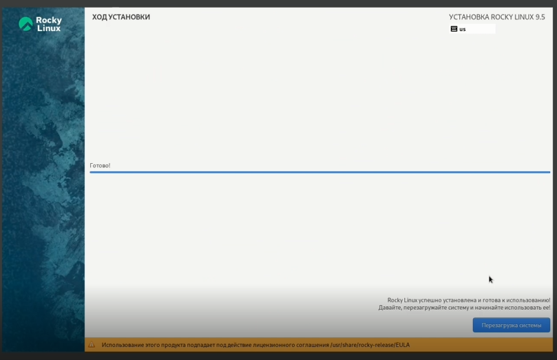{#fig:015 width=70%}

## Домашнее задание

## 1

Для поиска информации о 
1. Версия ядра Linux (Linux version).
2. Частота процессора (Detected Mhz processor).
3. Модель процессора (CPU0).
4. Объем доступной оперативной памяти (Memory available).
5. Тип обнаруженного гипервизора (Hypervisor detected)

использую поиск с помощью команды dmesg | grep -i "то, что ищем", а чтобы найти сразу несколько информаций использую флажок -Е

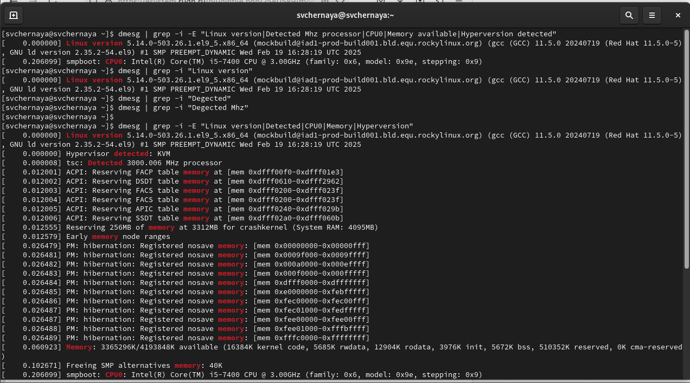{#fig:016 width=70%}

## 2

для нахождения типа файловой системы корневого раздела использую эту команду

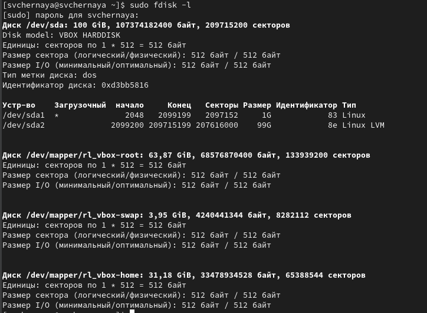{#fig:017 width=70%}

## 3

а для последовательности монтирования файловых систем использую :

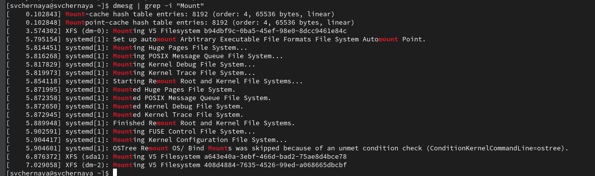{#fig:018 width=70%}

## Вывод

Я приобрела практические навыки
установки операционной системы на виртуальную машину, настройки ми-
нимально необходимых для дальнейшей работы сервисов.
