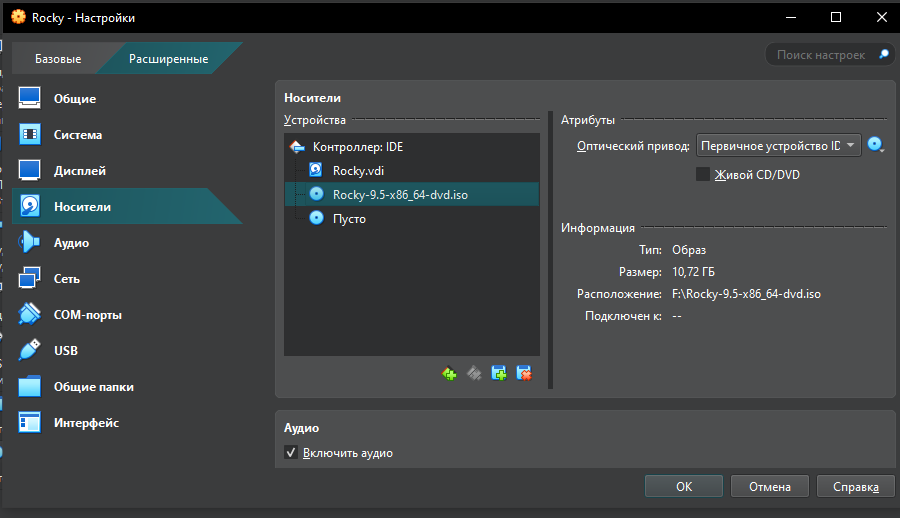

---
## Front matter
title: "Лабораторная №1"
subtitle: "Информационная безопасность"
author: "Черная София Витальевна"

## Generic otions
lang: ru-RU
toc-title: "Содержание"

## Bibliography
bibliography: bib/cite.bib
csl: pandoc/csl/gost-r-7-0-5-2008-numeric.csl

## Pdf output format
toc: true # Table of contents
toc-depth: 2
lof: true # List of figures
lot: true # List of tables
fontsize: 12pt
linestretch: 1.5
papersize: a4
documentclass: scrreprt
## I18n polyglossia
polyglossia-lang:
  name: russian
  options:
	- spelling=modern
	- babelshorthands=true
polyglossia-otherlangs:
  name: english
## I18n babel
babel-lang: russian
babel-otherlangs: english
## Fonts
mainfont: IBM Plex Serif
romanfont: IBM Plex Serif
sansfont: IBM Plex Sans
monofont: IBM Plex Mono
mathfont: STIX Two Math
mainfontoptions: Ligatures=Common,Ligatures=TeX,Scale=0.94
romanfontoptions: Ligatures=Common,Ligatures=TeX,Scale=0.94
sansfontoptions: Ligatures=Common,Ligatures=TeX,Scale=MatchLowercase,Scale=0.94
monofontoptions: Scale=MatchLowercase,Scale=0.94,FakeStretch=0.9
mathfontoptions:
## Biblatex
biblatex: true
biblio-style: "gost-numeric"
biblatexoptions:
  - parentracker=true
  - backend=biber
  - hyperref=auto
  - language=auto
  - autolang=other*
  - citestyle=gost-numeric
## Pandoc-crossref LaTeX customization
figureTitle: "Рис."
tableTitle: "Таблица"
listingTitle: "Листинг"
lofTitle: "Список иллюстраций"
lotTitle: "Список таблиц"
lolTitle: "Листинги"
## Misc options
indent: true
header-includes:
  - \usepackage{indentfirst}
  - \usepackage{float} # keep figures where there are in the text
  - \floatplacement{figure}{H} # keep figures where there are in the text
---

# Цель работы

Целью данной работы является приобретение практических навыков
установки операционной системы на виртуальную машину, настройки ми-
нимально необходимых для дальнейшей работы сервисов.

# Задание

1. Установка виртуальной машины VirtualBox(если её нет)
2. Установка и настройка операционной системы Rocky
3. Нахождение следующей инфоромации: 
 - Версия ядра Linux (Linux version).
 - Частота процессора (Detected Mhz processor).
 - Модель процессора (CPU0).
 - Объем доступной оперативной памяти (Memory available).
 - Тип обнаруженного гипервизора (Hypervisor detected).
 - Тип файловой системы корневого раздела.
 - Последовательность монтирования файловых систем.
 

# Теоретическое введение

Rocky - один из дистрибутивов операционной системы на базе ядра Linux.

Ключевые особенности операционной системы:

- ОС гарантирует полную совместимость на уровне двоичных файлов с Red Hat Enterprise Linux. Это позволяет пользователям без проблем переносить и запускать приложения, разработанные для RHEL.
- Операционная система использует SELinux (Security-Enhanced Linux) для удобного управления доступом и обеспечения высокого уровня безопасности.
- Дистрибутив включает в себя Dandified YUM — современный менеджер пакетов. Он предлагает более мощную производительность и улучшенные функции по сравнению с YUM, представленным в предыдущих версиях CentOS.
- Rocky Linux поддерживает различные файловые системы для оптимизации хранения данных в зависимости от индивидуальных требований, включая XFS, Ext4, и Btrfs.
- ОС применяет систему управления инициализацией Systemd. Она обеспечивает быструю загрузку и удобное администрирование службами через единую точку контроля.
- Поставляется вместе с инструментами Tuned и cgroups для мониторинга и оптимизации производительности. С их помощью можно легко настроить систему для различных рабочих нагрузок.
- Поддерживает Docker и Kubernetes, позволяя разрабатывать и развертывать контейнеризированные приложения.
- Rocky Linux обеспечивает совместимость с разными архитектурами, такими как x86_64 и ARM64. Благодаря этому ОС подходит для широкого спектра оборудования, от персональных компьютеров до серверов и облачных инфраструктур.
- ОС предоставляет стабильную работу с регулярными обновлениями и 10-летним жизненным циклом поддержки.

 
# Выполнение лабораторной работы

Захожу в VirtualBox(т.к. я выполняю лабораторную работу на домашнем компьютере) и нажимаею кнопку создать в верхней части экранаю (рис. [-@fig:001]).

{#fig:001 width=70%}

Выбираю имя. Папку оставляю без изменения, потому что этот путь меня устраивает. Так же выбираю образ ISO, скаченный с официального сайта Rocky. У меня файл dvd, так как Boot предназначен для восстановления системы.Minimal будет устанавливать очень простую рабочую систему с оболочком и некоторыми коммунальными установками. DVD имеет все программное обеспечение, включенное в ISO.(рис. [-@fig:002]).

{#fig:002 width=70%}

Автоматическую установку пропускаю(рис. [-@fig:003]).

{#fig:003 width=70%}
В разделе оборудование для основной памяти я уделяю 4096 МБ, а процессора ставлю 2(рис. [-@fig:004]).

{#fig:004 width=70%}

В разделе жесткий диск создаю новый виртуальный жесткий диск, уделяя ему размер в 50 ГБ. Тип и формат жесткого диска оставляю VDI(рис. [-@fig:005]).

{#fig:005 width=70%}

В настройках виртуальной системы, в разделе носители проверяю наличие ISO файла(рис. [-@fig:006]).

{#fig:006 width=70%}

Запускаю виртуальную систему через install rocky linux 9.5(рис. [-@fig:007]).

{#fig:007 width=70%}

Далее переходим в настройки виртуальной системы, в качестве раскладки клавиатуры выбираем Английскую и Русскую(рис. [-@fig:008]).

{#fig:008 width=70%}

В разделе дата и время оставляю московское (рис. [-@fig:009]).

{#fig:009 width=70%}

Далее в разделе выбор программы в качестве базового окружения устанавливаю сервер с GUI, а в выбранном ПО для выбранной среды устанавливаю стандартную среду разработку(средства разработки)(рис. [-@fig:010]).

{#fig:010 width=70%}

Выключаю Kdump (рис. [-@fig:011]).

{#fig:011 width=70%}

Подключаю инетрнет в разделе "Сеть и имя узла"(рис. [-@fig:012]).

{#fig:012 width=70%} 

Устанавливаю пароль для root(администратора)(рис. [-@fig:013]).

{#fig:013 width=70%} 

Создаю пользователя и пароль для него (рис. [-@fig:014]).

{#fig:014 width=70%}

Устанавливаю операционную систему Rocky и после загрузки корректно ее перезагружаю(кнопка перезагрузка системы)(рис. [-@fig:015]).

{#fig:015 width=70%}

# Домашнее задание

Для поиска информации о 
1. Версия ядра Linux (Linux version).
2. Частота процессора (Detected Mhz processor).
3. Модель процессора (CPU0).
4. Объем доступной оперативной памяти (Memory available).
5. Тип обнаруженного гипервизора (Hypervisor detected)

использую поиск с помощью команды dmesg | grep -i "то, что ищем", а чтобы найти сразу несколько информаций использую флажок -Е(рис. [-@fig:016]).

{#fig:016 width=70%}

для нахождения типа файловой системы корневого раздела использую эту команду(рис. [-@fig:017]).

{#fig:017 width=70%}

а для последовательности монтирования файловых систем использую : (рис. [-@fig:017]).

{#fig:018 width=70%}

# Ответы на контрольные вопросы

1. Учетная запись содержит необходимые для идентификации пользователя при подключении к системе данные, а так же информацию для авторизации и учета: системного имени (user name) (оно может содержать только латинские буквы и знак нижнее подчеркивание, еще оно должно быть уникальным), идентификатор пользователя (UID) (уникальный идентификатор пользователя в системе, целое положительное число), идентификатор группы (CID) (группа, к к-рой относится пользователь. Она, как минимум, одна, по умолчанию - одна), полное имя (full name) (Могут быть ФИО), домашний каталог (home directory) (каталог, в к-рый попадает пользователь после входа в систему и в к-ром хранятся его данные), начальная оболочка (login shell) (командная оболочка, к-рая запускается при входе в систему).

2. Для получения справки по команде: <команда> —help; для перемещения по файловой системе - cd; для просмотра содержимого каталога - ls; для определения объёма каталога - du <имя каталога>; для создания / удаления каталогов - mkdir/rmdir; для создания / удаления файлов - touch/rm; для задания определённых прав на файл / каталог - chmod; для просмотра истории команд - history

3. Файловая система - это порядок, определяющий способ организации и хранения и именования данных на различных носителях информации. Примеры: FAT32 представляет собой пространство, разделенное на три части: олна область для служебных структур, форма указателей в виде таблиц и зона для хранения самих файлов. ext3/ext4 - журналируемая файловая система, используемая в основном в ОС с ядром Linux.

4. С помощью команды df, введя ее в терминале. Это утилита, которая показывает список всех файловых систем по именам устройств, сообщает их размер и данные о памяти. Также посмотреть подмонтированные файловые системы можно с помощью утилиты mount.

5. Чтобы удалить зависший процесс, вначале мы должны узнать, какой у него id: используем команду ps. Далее в терминале вводим команду kill < id процесса >. Или можно использовать утилиту killall, что "убьет" все процессы, которые есть в данный момент, для этого не нужно знать id процесса. 

# Выводы

Я приобрела практические навыки
установки операционной системы на виртуальную машину, настройки ми-
нимально необходимых для дальнейшей работы сервисов.
