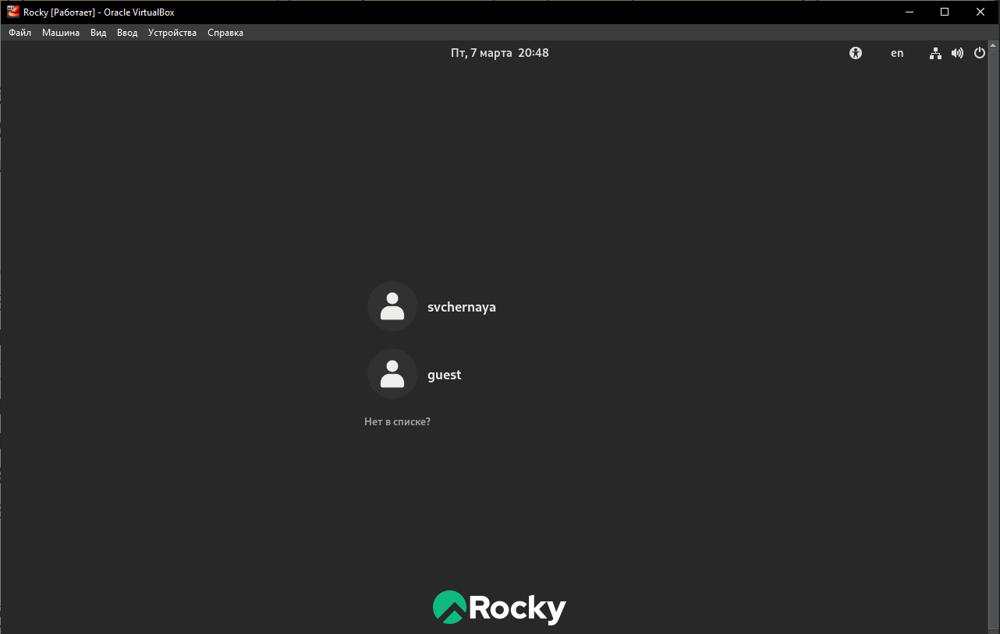
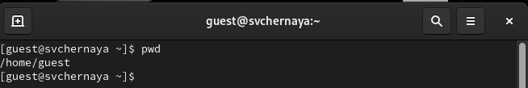
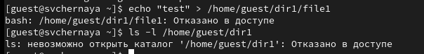

---
## Front matter
title: "Лабораторная работа №2"
subtitle: "Основы информационной безопасности"
author: "Черная София Витальевна"

## Generic otions
lang: ru-RU
toc-title: "Содержание"

## Bibliography
bibliography: bib/cite.bib
csl: pandoc/csl/gost-r-7-0-5-2008-numeric.csl

## Pdf output format
toc: true # Table of contents
toc-depth: 2
lof: true # List of figures
lot: true # List of tables
fontsize: 12pt
linestretch: 1.5
papersize: a4
documentclass: scrreprt
## I18n polyglossia
polyglossia-lang:
  name: russian
  options:
	- spelling=modern
	- babelshorthands=true
polyglossia-otherlangs:
  name: english
## I18n babel
babel-lang: russian
babel-otherlangs: english
## Fonts
mainfont: IBM Plex Serif
romanfont: IBM Plex Serif
sansfont: IBM Plex Sans
monofont: IBM Plex Mono
mathfont: STIX Two Math
mainfontoptions: Ligatures=Common,Ligatures=TeX,Scale=0.94
romanfontoptions: Ligatures=Common,Ligatures=TeX,Scale=0.94
sansfontoptions: Ligatures=Common,Ligatures=TeX,Scale=MatchLowercase,Scale=0.94
monofontoptions: Scale=MatchLowercase,Scale=0.94,FakeStretch=0.9
mathfontoptions:
## Biblatex
biblatex: true
biblio-style: "gost-numeric"
biblatexoptions:
  - parentracker=true
  - backend=biber
  - hyperref=auto
  - language=auto
  - autolang=other*
  - citestyle=gost-numeric
## Pandoc-crossref LaTeX customization
figureTitle: "Рис."
tableTitle: "Таблица"
listingTitle: "Листинг"
lofTitle: "Список иллюстраций"
lotTitle: "Список таблиц"
lolTitle: "Листинги"
## Misc options
indent: true
header-includes:
  - \usepackage{indentfirst}
  - \usepackage{float} # keep figures where there are in the text
  - \floatplacement{figure}{H} # keep figures where there are in the text
---

# Цель работы

Получение практических навыков работы в консоли с атрибутами фай-
лов, закрепление теоретических основ дискреционного разграничения до-
ступа в современных системах с открытым кодом на базе ОС Linux.

# Задание

1. Создание новой учетной записи guest
2. Работа с атрибутами файлов
3. Работа над созданием 
4. Заполнение таблицы «Установленные права и разрешённые действия»
5. Определение тех или иные минимально необходимых прав для выполнения операций внутри директории dir1

# Теоретическое введение

В операционной системе Linux команда lsattr отображает характеристики атрибутов и их возможные значения для устройств в системе.
Использование в Linux команды lsattr

Логическое имя устройства следует указывать с помощью флага -l (Name), либо использовать комбинацию одного или всех флагов -c (Class), -s (Subclass) и -t (Type), чтобы однозначно идентифицировать предопределённое устройство.
По умолчанию

На практике команда lsattr принимает в качестве аргументов имена файлов и каталогов для проверки. Если мы не указываем файл, он проверяет атрибуты текущего рабочего каталога.

В результате команда lsattr отображает по одному символу для каждого атрибута, чтобы указать, включён этот атрибут или нет:

oleg@mobile:~:$ lsattr abc.txt
--------------e------- abc.txt
oleg@mobile:~:$

Однако lsattr не показывает имена атрибутов. Таким образом, нам, возможно, придётся знать значение каждого буквенного кода, чтобы интерпретировать вывод.

Права доступа делятся на три группы:

    user — права владельца файла;
    group — права группы, которой принадлежит файл;
    other — права всех остальных пользователей системы.
    
Стандартными правами доступа являются:

    для файлов — 644 (rw-r—r—);
    для директорий — 755 (rwxr-xr-x).

# Выполнение лабораторной работы

1. В установленной при выполнении предыдущей лабораторной работы операционной системе Rocky создаю учётную запись пользователя guest (используя учётную запись администратора):useradd guest(рис. [-@fig:001]).
 
{#fig:001 width=70%}

2. Задаю пароль для пользователя guest (использую учётную запись администратора) с помощью команды: passwd guest(рис. [-@fig:002]).

{#fig:002 width=70%}

3. Вхожу в систему от имени пользователя guest(рис. [-@fig:003]).

{#fig:003 width=70%}

4. Определяю директорию, в которой я нахожусь, командой pwd. Результат получаю : /home/guest. Однако в приглашении командной строчки стоит знак ~ , указывающий, что данная директория является домашней.(рис. [-@fig:004]).

{#fig:004 width=70%}

Проверяю, на всякий случай, командой перехода в домашнюю директорию : cd ~. Директория, в которой мы находились, не изменилась, что свидетельствует о том, что мы действительно находимся в домашней директории(рис. [-@fig:005]).

{#fig:005 width=70%}

5. Уточняю имя моего пользователя командой whoami(рис. [-@fig:006]).

{#fig:006 width=70%}

6. Уточняю имя моего пользователя, его группу, а также группы, куда вхо-
дит пользователь, командой id. Выведенные значения uid, gid и др. за-
помнинаю. Сравниваю вывод id с выводом команды groups. Замечаю, что с помощью команды id можно узнать больше информации о пользователе guest и его группы(рис. [-@fig:007]).

{#fig:007 width=70%}

7. Сравниваю полученную информацию об имени пользователя с данными, выводимыми в приглашении командной строчки и замеча, что они совпадают.(рис. [-@fig:006]).

{#fig:008 width=70%}

8. Просматриваю файл /etc/passwd командой cat /etc/passwd. Нахожу в нем свою учетную запись(выделено красным), определяю, что uid пользователя и gid пользователя равны 1001. Они совпадают с запомненными мною ранее при выводе с помощью команды id(рис. [-@fig:009]).

{#fig:009 width=70%}

Проверяю себя с помощью команлы cat /etc/passwd | grep guest. Убеждаюсь, что я все определила верно.(рис. [-@fig:010]).

{#fig:010 width=70%}

9. Вывожу список поддиректорий директории /home и их права. Замечаю, что все права есть только у создателя директории, у группы и остальных пользователей никаких прав нет.(рис. [-@fig:011]).

{#fig:011 width=70%}

10. Проверяю есть ли какие-нибудь расширенные атрибуты на поддерикториях с помощью команды lsattr. Нет, никаких атрибутов у поддиректорий нет. Увидеть расширенные атрибуты у других пользователей так же не удалось(рис. [-@fig:012]).

{#fig:012 width=70%}

11. Создаю в домашней директории поддиректорию dir1 с помощью команды mkdir. Определеяю командами ls -l и lsattr какие права доступа и расширенные атрибуты были выставлены на директорию dir1. С помощью команды ls -l узнаю, что у создателя есть все права(на чтение, на записывание и на заход в директорию). У группы и остальных пользователей есть те же права, кроме записывания(создания файлов или удаление например). Команда lsattr ничего не выводит. (рис. [-@fig:013]).

{#fig:013 width=70%}

12. Снимаю все атрибуты с директории dir1 с помощью команды chmod 000 dir1. Проверяю права доступа с помощью ls -l/Замечаю, что теперь у всех нет прав ни на что.(рис. [-@fig:014]).

{#fig:014 width=70%}

13. Пытаюсь создать в директории dir1 файл fil1 командой echo "test" > /home/guest/dir1/file1. Отказ в доступе происходит из-за команды chmod 000, которая убирает все права у всех пользователей. Так же ls -l /home/guest/dir1 показывает, что файла нет. (рис. [-@fig:015]).

{#fig:015 width=70%}

14. 
## Заполнение таблицы 2.1

| Права директории  | Права файла  | Создание файла | Удаление файла | Запись в файл | Смена директории | Просмотр файлов в директории | Переименование файла | Смена атрибутов файла |
|:------------------|:-------------|:---------------|:---------------|:--------------|:-----------------|:-----------------------------|:---------------------|:----------------------|
|d(000)|(000)| -| -| -| -| -| -| -| -|
|d(000)|(100)| -| -| -| -| -| -| -| -|
|d(000)|(200)| -| -| -| -| -| -| -| -|
|d(000)|(300)| -| -| -| -| -| -| -| -|
|d(000)|(400)| -| -| -| -| -| -| -| -|
|d(000)|(500)| -| -| -| -| -| -| -| -|
|d(000)|(600)| -| -| -| -| -| -| -| -|
|d(000)|(700)| -| -| -| -| -| -| -| -|
|d(100)|(000)| -| -| -| -|+| -| -|+|
|d(100)|(100)| -| -| -| -|+| -| -|+|
|d(100)|(200)| -| -|+| -|+| -| -|+|
|d(100)|(300)| -| -|+| -|+| -| -|+|
|d(100)|(400)| -| -|-|+|+| -| -|+|
|d(100)|(500)| -| -|-|+|+| -| -|+|
|d(100)|(600)| -| -|+|+|+| -| -|+|
|d(100)|(700)| -| -|+|+|+| -| -|+|
|d(200)|(000)| -| -|-|-|-| -| -|-|
|d(200)|(100)| -| -|-|-|-| -| -|-|
|d(200)|(200)| -| -|-|-|-| -| -|-|
|d(200)|(300)| -| -|-|-|-| -| -|-|
|d(200)|(400)| -| -|-|-|-| -| -|-|
|d(200)|(500)| -| -|-|-|-| -| -|-|
|d(200)|(600)| -| -|-|-|-| -| -|-|
|d(200)|(700)| -| -|-|-|-| -| -|-|
|d(300)|(000)|+|+|-|-|+| -|+|+|
|d(300)|(100)|+|+|-|-|+| -|+|+|
|d(300)|(200)|+|+|+|-|+| -|+|+|
|d(300)|(300)|+|+|+|-|+| -|+|+|
|d(300)|(400)|+|+|-|+|+| -|+|+|
|d(300)|(500)|+|+|-|+|+| -|+|+|
|d(300)|(600)|+|+|+|+|+| -|+|+|
|d(300)|(700)|+|+|+|+|+| -|+|+|
|d(400)|(000)|-|-|-|-|-|+|-|-|
|d(400)|(100)|-|-|-|-|-|+|-|-|
|d(400)|(200)|-|-|-|-|-|+|-|-|
|d(400)|(300)|-|-|-|-|-|+|-|-|
|d(400)|(400)|-|-|-|-|-|+|-|-|
|d(400)|(500)|-|-|-|-|-|+|-|-|
|d(400)|(600)|-|-|-|-|-|+|-|-|
|d(400)|(700)|-|-|-|-|-|+|-|-|
|d(500)|(000)|-|-|-|-|+|+|-|+|
|d(500)|(100)|-|-|-|-|+|+|-|+|
|d(500)|(200)|-|-|+|-|+|+|-|+|
|d(500)|(300)|-|-|+|-|+|+|-|+|
|d(500)|(400)|-|-|-|+|+|+|-|+|
|d(500)|(500)|-|-|-|+|+|+|-|+|
|d(500)|(600)|-|-|+|+|+|+|-|+|
|d(500)|(700)|-|-|+|+|+|+|-|+|
|d(600)|(000)|-|-|-|-|-|+|-|-|
|d(600)|(100)|-|-|-|-|-|+|-|-|
|d(600)|(200)|-|-|-|-|-|+|-|-|
|d(600)|(300)|-|-|-|-|-|+|-|-|
|d(600)|(400)|-|-|-|-|-|+|-|-|
|d(600)|(500)|-|-|-|-|-|+|-|-|
|d(600)|(600)|-|-|-|-|-|+|-|-|
|d(600)|(700)|-|-|-|-|-|+|-|-|
|d(700)|(000)|+|+|-|-|+|+|+|+|
|d(700)|(100)|+|+|-|-|+|+|+|+|
|d(700)|(200)|+|+|+|-|+|+|+|+|
|d(700)|(300)|+|+|+|-|+|+|+|+|
|d(700)|(400)|+|+|-|+|+|+|+|+|
|d(700)|(500)|+|+|-|+|+|+|+|+|
|d(700)|(600)|+|+|+|+|+|+|+|+|
|d(700)|(700)|+|+|+|+|+|+|+|+|

15. 
## Заполнение таблицы 2.2

| | | | | |
|-|-|-|-|-|
|Операция| |Минимальные  права на  директорию| |Минимальные  права на файл|
|Создание файла| |d(300)| |-|
|Удаление файла| |d(300)| |-|
|Чтение файла| |d(100)| |(400)|
|Запись в файл| |d(100)| |(200)|
|Переименование файла| |d(300)| |(000)|
|Создание поддиректории| |d(300)| |-|
|Удаление поддиректории| |d(300)| |-|

# Выводы

Были получены практические навыки работы в консоли с атрибутами файлов, закреплены теоретические основы дискреционного разграничения доступа в современных системах с открытым кодом на базе ОС Linux.

